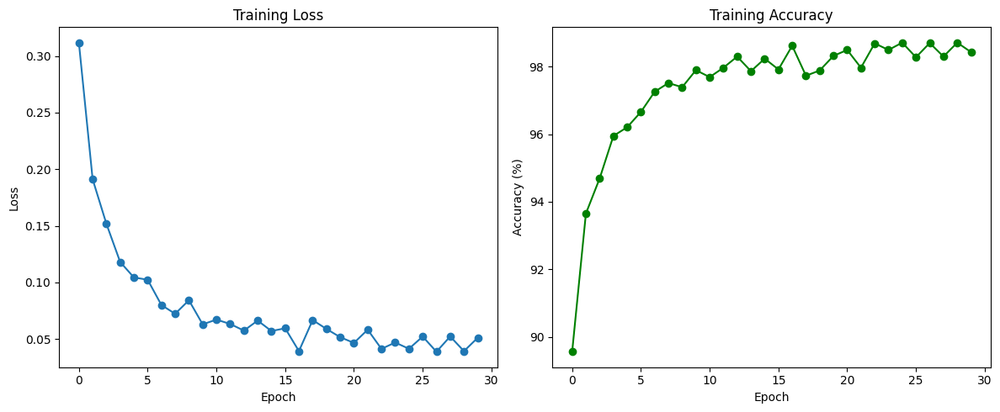
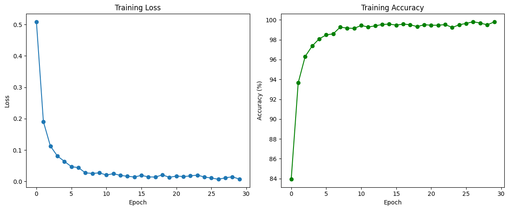

# 🍎 A Comparative Study of Convolutional Neural Networks and Vision Transformers for Fruit Classification

This project investigates the performance of **Convolutional Neural Networks (CNNs)** and **Vision Transformers (ViTs)** on the task of fruit classification. Leveraging a high-quality image dataset of fruits, the study evaluates and compares both model architectures based on per-class accuracy and detailed classification metrics.

---

## 📦 Dataset

The dataset used is publicly available on Kaggle:

[Fruits Classification Dataset by Utkarsh Saxena](https://www.kaggle.com/datasets/utkarshsaxenadn/fruits-classification)

- Classes: Apple, Banana, Grape, Mango, Strawberry

---

## 🧠 Models Compared

1. **Vision Transformer (ViT)**
2. **Convolutional Neural Network (CNN)**

---

## 🧪 Results

### 🔍 Vision Transformer (ViT) Performance

**📊 Per-Class Accuracy:**
- Apple: 95.00%
- Banana: 92.50%
- Grape: 82.50%
- Mango: 90.00%
- Strawberry: 97.50%

### 🔍 Convolutional Neural Network (CNN) Performance

**📊 Per-Class Accuracy:**
- Apple: 85.00%
- Banana: 95.00%
- Grape: 97.50%
- Mango: 95.00%
- Strawberry: 100.00%

